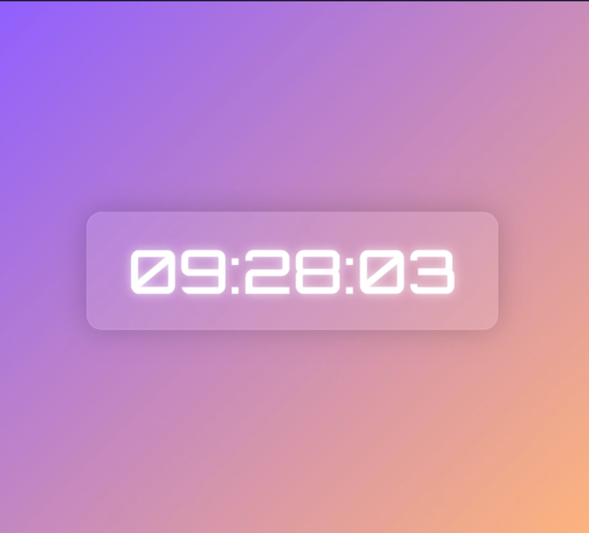

# Digital Clock

A simple and responsive digital clock built using HTML, CSS, and JavaScript. This project displays the current time in a dynamic and stylish format.

## 🕒 Live Preview

Check out the live demo of the digital clock [here](https://shivam0400.github.io/Digital-Clock/)  

## 📌 Features

- Displays real-time hours, minutes, and seconds..
- 12-hour or 24-hour format (if implemented).
- Responsive design for different screen sizes.
- Smooth animations for a visually appealing look.
- Easy to modify and customize.

## 🛠️ Technologies Used

- **HTML** - Structure of the clock.
- **CSS** - Styling and layout.
- **JavaScript** - Functionality to update the time dynamically.

## 📷 Screenshot



## 🚀 How to Use

1. **Clone the repository**  
   ```bash
   git clone https://github.com/Shivam0400/Digital-Clock.git
 2. Navigate to the project folder
    ```bash
     cd Digital-Clock
 3. Open index.html in a web browser.
Simply open the file in any browser to see the clock in action.

## 🏗️ How It Works
JavaScript fetches the current time using the Date object.
The time updates dynamically every second.
CSS provides styling, including fonts and animations.

## 📌 Future Improvements
Add AM/PM toggle for 12-hour format.
Allow users to customize colors and themes.
Implement a dark mode option.

## 💡 Contributing
Contributions are welcome! Feel free to fork this repository and make improvements.

## 📜 License
This project is open-source and available under the MIT License.

